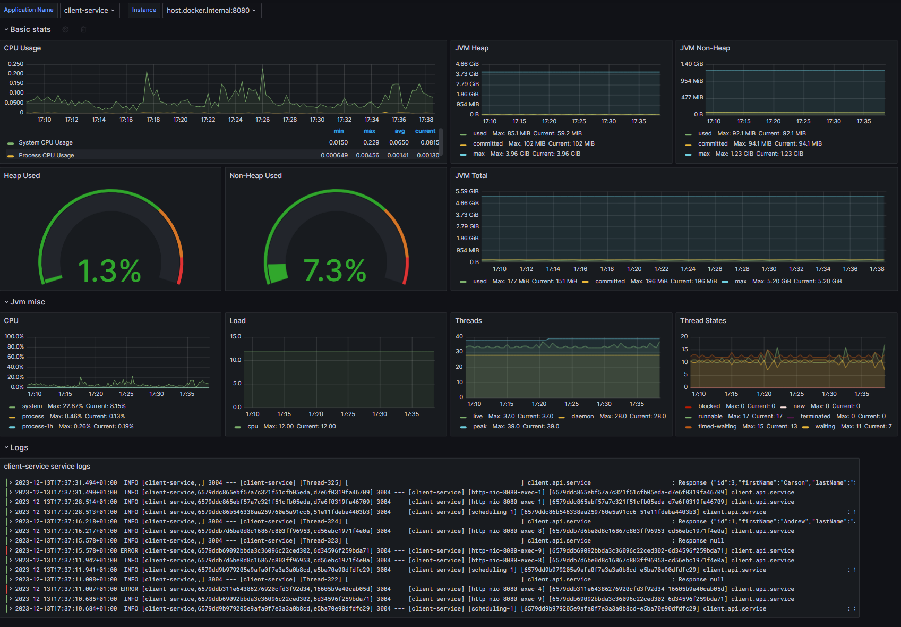
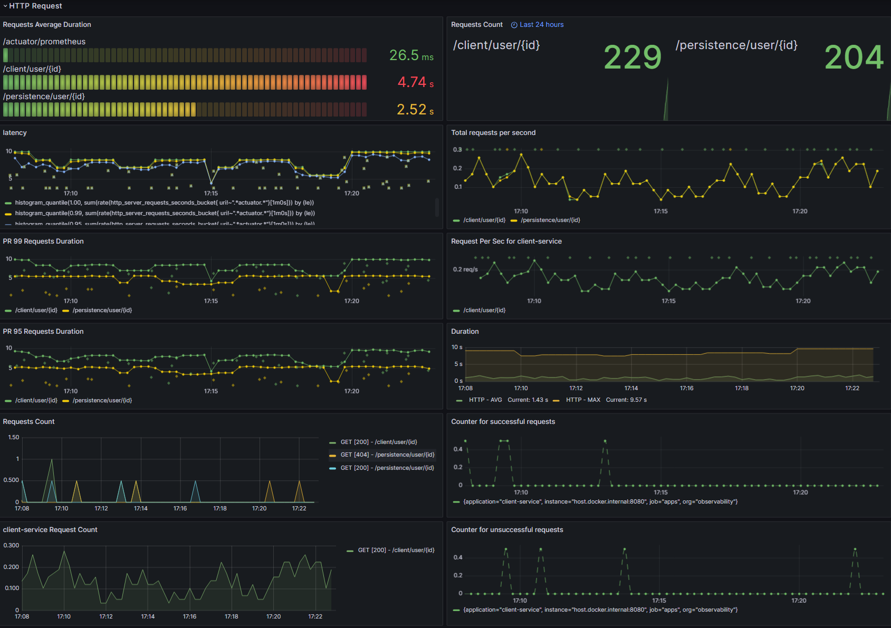
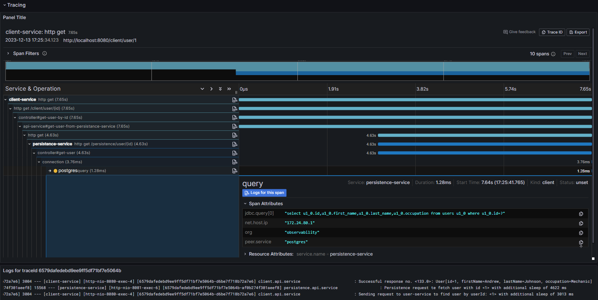

# Observability

Demo setup for Spring Boot apps with Prometheus, Grafana, Loki and Tempo tools for observing applications.

## Architecture

### 1. Spring Boot applications:

- Client service - Application is responsible for generating traffic on the network towards other service

- Persistence service - Service responsible for retrieving records from database.

### 2. Observation layer

- Prometheus - Service which is scraping diagnostics data shared by applications

- Loki - Service responsible for receiving logs sent by applications

- Grafana - GUI for scraped data

## Why

The idea is to basically auto-generate traffic by client service. Every 45 seconds there are around 25 requests
generated.

Every request is being delayed randomly within 5000 ms both by client-service and persistance-service.

This has been made to simulate problems in architecture which can be spotted in Grafana GUI

## How

1. Go to **docker** directory, execute ```docker compose up```,
2. Build and run both **client** and **persistence** app,
3. Go to ```http://localhost:3000```, open dashboards and enjoy

## Available dashboards

1. Main dashboard

This dashboard contains basic information about the state of given application with logs attached.


---

2. Http statistics and tracing dashboard

This one is created to track traffic on network between applications. You can track basically every information about
the traffic e.g:

- latency,
- avg. response time of endpoints,
- amount of requests,
- many more.
  

---  
One of the most useful feature must be distributed tracing of requests between services and even database using Grafana
Tempo. Thanks to this tool You can see exactly how long every step of the request takes and find possible bottlenecks of
your system.


---

